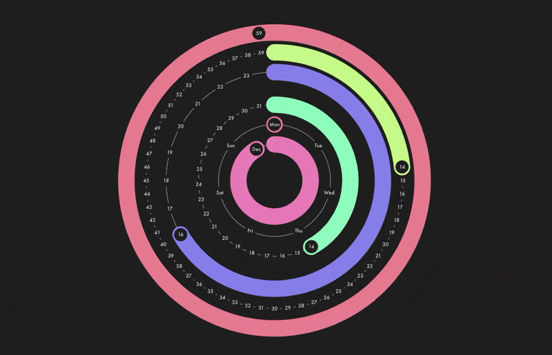

    

# Polar Clock

**A colorful, animated clock in polar coordinates.**

Not a very good clock, not a very good screen *saver*, but *oh-so very pretty*.

Inspired by Mike Bostock's [Polar Clock III](https://bl.ocks.org/mbostock/c150b717e18d387e1b98) and the original, flash-based screensaver [PolarClock](https://web.archive.org/web/20190220000556/http://blog.pixelbreaker.com/polarclock) by [pixelbreaker](https://www.pixelbreaker.com/).

[**See it in action →**](https://polarclockelm.sandydoo.me/)

 

#### Installation

1. Clone the repository.

   `git clone https://github.com/sandydoo/PolarClockElm.git`

2. Install packages

   `yarn install`

3. Compile the code.

   * For local development:

     `yarn serve`

   * For the final release:

     `yarn build`

 

#### Historical reference

The original Polar Clock by pixelbreaker.

Mike Bostock's Polar Clock III.

