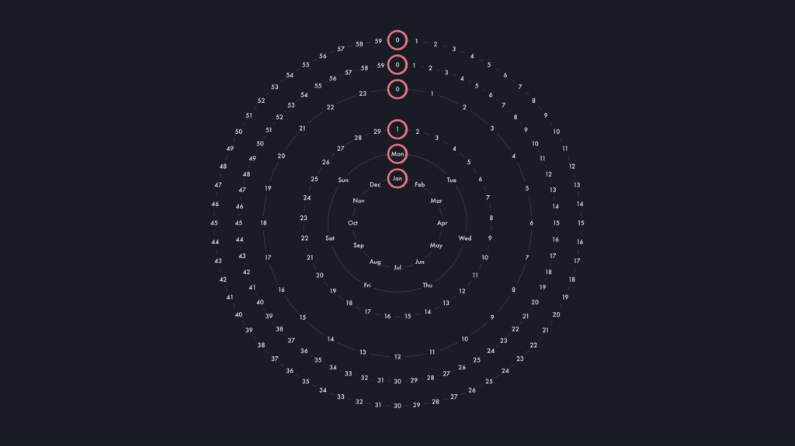
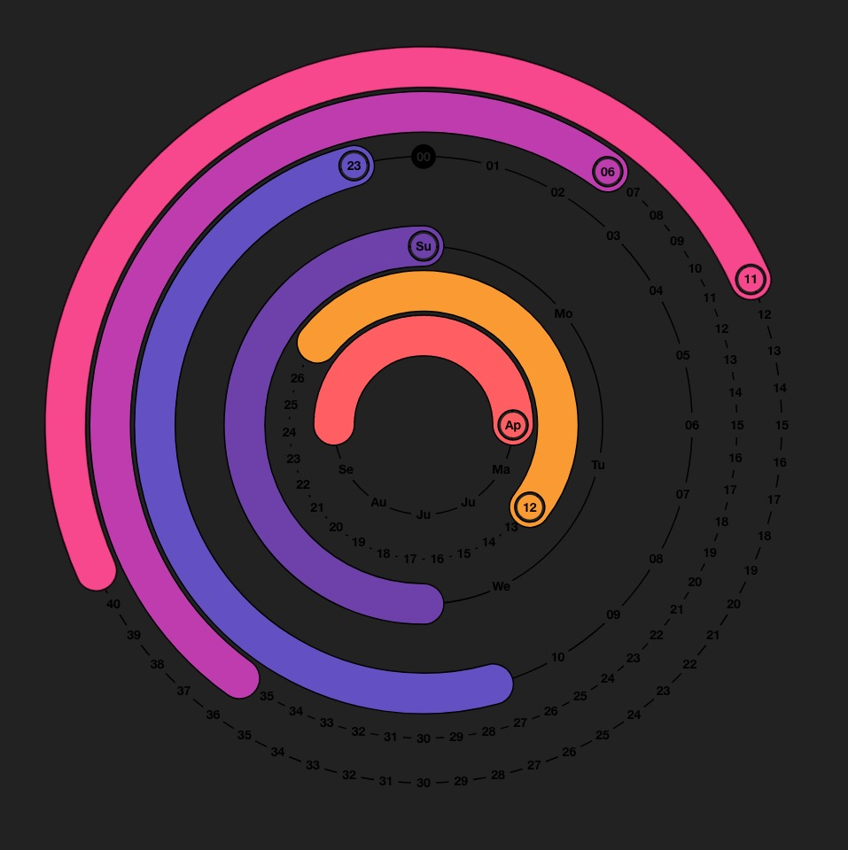

<div>
  <a href="https://polarclockelm.sandydoo.me/">
    
  </a>
</div>


# Polar Clock

**A colorful animated polar clock in the browser. Built with Elm and inspired by an infamous screensaver.**

Not a very good clock, not a very good screen *saver*, but *oh-so very pretty*.

Inspired by Mike Bostock's [Polar Clock III](https://bl.ocks.org/mbostock/c150b717e18d387e1b98) and the original, flash-based screensaver [PolarClock](https://web.archive.org/web/20190220000556/http://blog.pixelbreaker.com/polarclock) by [pixelbreaker](https://www.pixelbreaker.com/).

[**See it in action →**](https://polarclockelm.sandydoo.me/)

<br>


#### Installation

1. Clone the repository.

   ```bash
   git clone https://github.com/sandydoo/PolarClockElm.git
   ```

2. Install packages.

   ```bash
   yarn install
   ```

3. Compile the code.

   * For local development:

     ```bash
     yarn serve
     ```

   * For the final release:

     ```bash
     yarn build
     ```

<br>


#### Historical reference

The original Polar Clock by pixelbreaker.


Mike Bostock's Polar Clock III.


